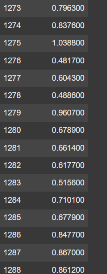
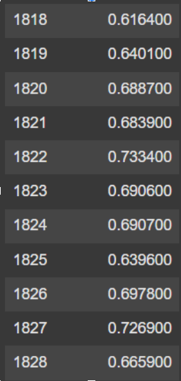
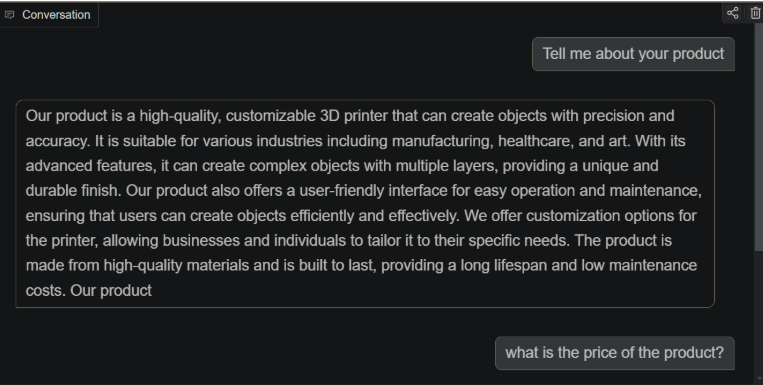
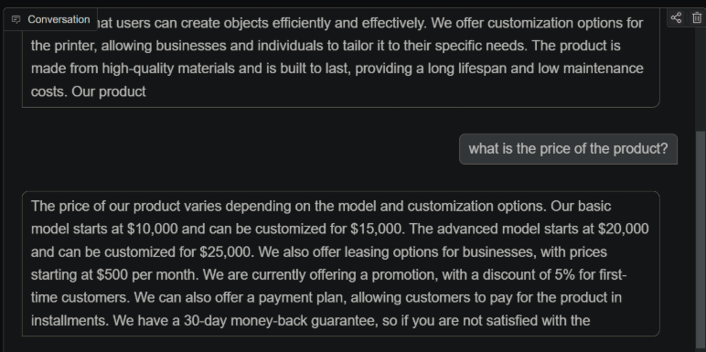

# Fine-tuning-LLMs

The goal of lab 2 was to fine-tune a pre-existing large language model, upload it to Huggingface, and allow users to interact with the model through a UI. This space can be found on Huggingface [Link to UI](https://huggingface.co/spaces/SWAH-KTH/lab2). Code for UI is in app.py

You can take a model-centric approach or data-centric approach to improve the model performance. For the model-centric way optimizing hyperparameters such as learning rate, batch size, and/or number of epochs can boost performance. You can also try to switch the model architecture from smaller to more efficient models. Another strategy might be using different optimizers during training or regularization such as dropout to prevent overfitting. If you instead want to go with the data-centric approach you can employ strategies like augmenting, adding domain-specific data, removing low-quality data, and or diversifying the data to for example include multiple languages.

In this project, we decided to go with the model-centric approach. We have fine-tuned two main models. In the first model, we tried to optimize the hyperparameters of training such as the learning rate, batch size, and optimizer. In the second model, we tried instead to have a larger model (more parameters) meaning that the model should have a larger capability for learning than the first model. We did that by increasing the size of the LoRa adapter which made the training slower as we doubled the amount of parameter from 24 million to 48 million. For the first model, we were able to stabilize the loss to be on average between 0.5 and 0.7 as it was first jumping up to 0.9 or even 1. Here is the loss before (left) and after (right):

The loss values looked similar for both models so we decided to instead test the models with sample prompts. During testing, even though the first model was trained for a much longer time than the second model(~2000 iterations vs ~100 iterations), the second one showed better performance than the first model on the sample prompts. 

The UI we created to interact with the model is a scenario chatbot where you can decide between 4 different roles from our model. It can be a Job interviewer, a salesperson, a language tutor, or a debate opponent. Depending on the choice you will get targeted questions or answers which will help the user to train on answering and questioning on that specific scenario. Example of conversation with a salesperson:

